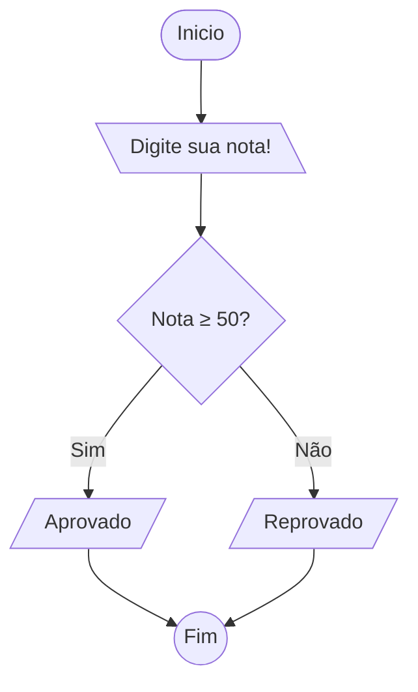
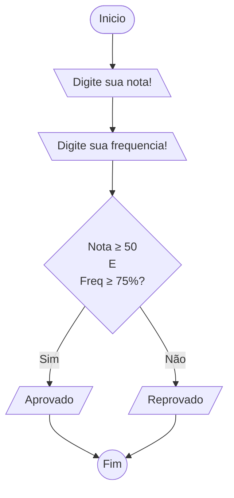
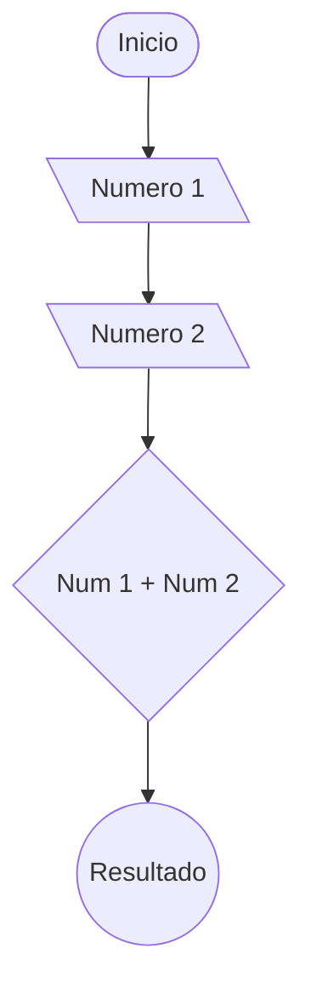
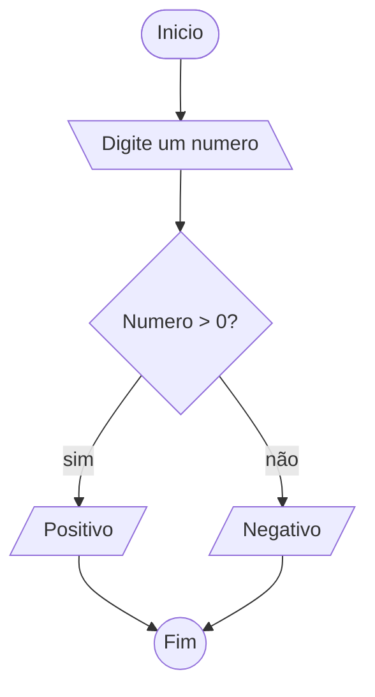
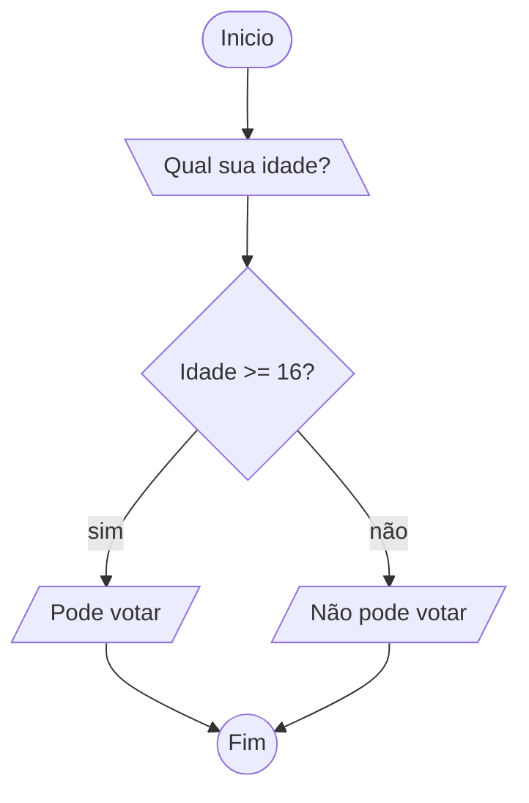
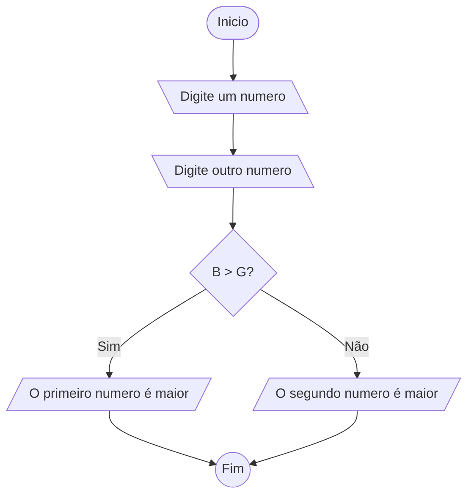
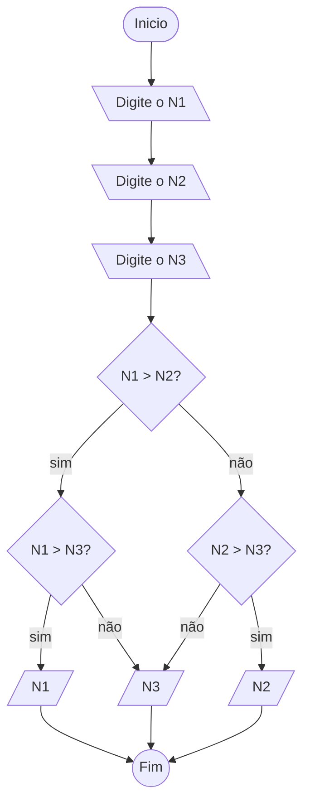
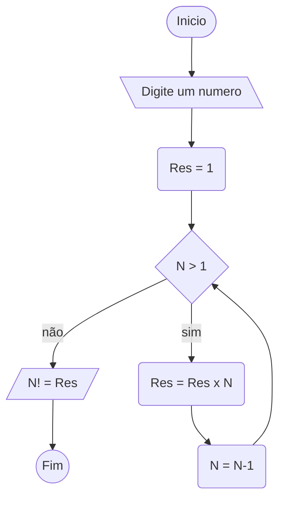
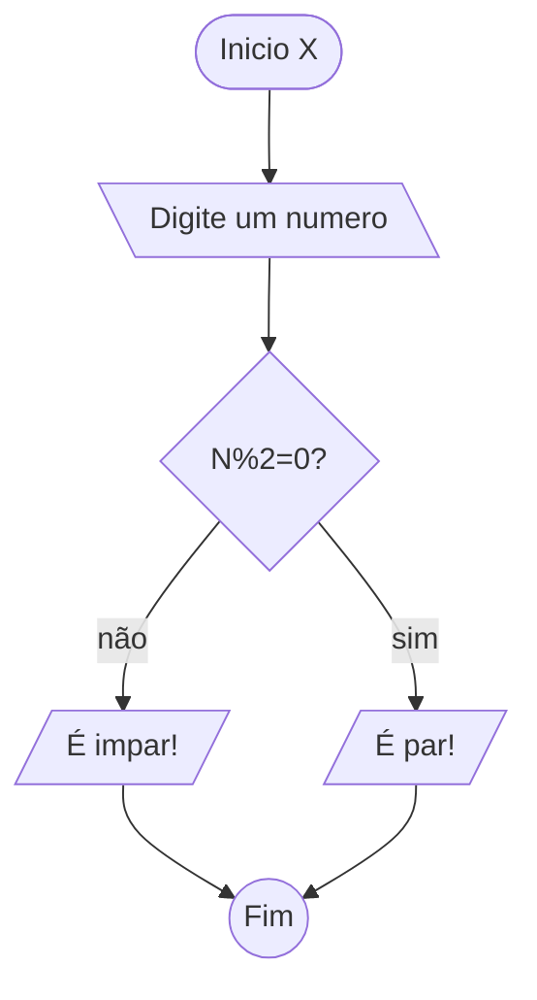

    EX 1

    EX 2

    EX 3

    EX 4

    EX 5

    EX 6

    EX 7

    EX 8 

    EX 9

    EX 10
```mermaid
flowchart TD
A([Inicio X]) --> B[\Digite um numero\]
    B --> C{}
    C --> |sim| D[//]
    C --> |não| E[//]
    D --> F((Fim))
    E --> F
```